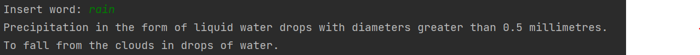

# English Dictionary 
**Version 1.0.0**

#About The Project
 
-   This english dictionary project allow users get a word's meaning.

- Motivations -
    - Mainly display my test and README writing skills.
    - Create an intercative user tool.
    
- Built with  - json, difflib, termcolor
___

# Getting Started
1. clone repository
```python
https://github.com/Chensass/English_Dictionary.git
```
2. Install requierments packages
```python
pip3 install -r requirements.txt
```
---
#Usage
-   The user place a search word and the meaning of the word is printed.



-   If the inserted word has a key mistake the dictionary will offer to correct it.

---
# Contributors

- Chen Sasson <chensa312@gmail.com>
